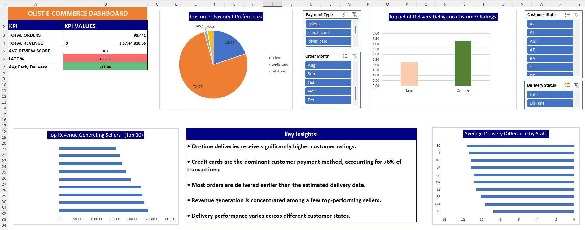

# Olist-Ecommerce-Business-Analytics
## 📊 Olist E-Commerce Business Analytics Dashboard

## 📌 Project Overview
This project presents an end-to-end Business Analytics solution developed using the Brazilian Olist E-Commerce public dataset in Microsoft Excel. The goal of this project is to transform raw e-commerce data into meaningful business insights through data cleaning, data modeling, KPI analysis, and interactive dashboard visualization.

The dashboard helps analyze:
- Delivery performance
 Customer satisfaction
- Seller contribution
- Payment behavior
- Regional delivery trends

---

## 🎯 Project Objective
To analyze e-commerce marketplace operations and identify key business insights related to customer experience, delivery efficiency, revenue generation, and payment preferences using an interactive Excel dashboard.

---

## 🛠 Tools & Techniques Used
- Microsoft Excel
- XLOOKUP
- Pivot Tables
- Pivot Charts
- KPI Calculations
- Slicers & Interactive Filters
- Data Cleaning & Wrangling
- Business Analysis
- Dashboard Design & Visualization

---

## 📈 Key Performance Indicators (KPIs)
- Total Orders
- Total Revenue
- Average Review Score
- Late Delivery Percentage
- Average Early Delivery Days

---

## 📊 Business Questions Solved

## 1️⃣ Which states experience the highest delivery delays?
Analyzed average delivery delay time across customer states to identify weaker delivery-performing regions.

## 2️⃣ Do delivery delays reduce customer satisfaction?
Compared delivery status with customer review scores to understand the impact of delays on customer ratings.

## 3️⃣ Which sellers generate the highest revenue?
Identified top-performing sellers based on total payment value generated.

## 4️⃣ How do customers prefer to pay?
Analyzed customer payment behavior across multiple payment methods.

---

## 💡 Key Insights
- On-time deliveries receive significantly higher customer ratings.
- Credit cards dominate customer payment behavior.
- Most orders are delivered earlier than estimated delivery dates.
- Revenue generation is concentrated among a few top-performing sellers.
- Delivery performance varies across different customer states.

---

## 📷 Dashboard Preview

---

## 🧩 Data Modeling & Transformation
The project involved combining and transforming multiple datasets including:
- Orders
- Customers
- Payments
- Reviews
- Products
- Sellers
- Location Data

XLOOKUP and calculated business logic columns were used to create a consolidated master dataset for analysis.

---

## 🚀 Skills Demonstrated
- Data Cleaning
- Data Wrangling
- Data Modeling
- Business Analytics
- Dashboard Development
- Data Visualization
- Interactive Reporting
- KPI Analysis
- Problem Solving

---

## 📁 Repository Contents
- Excel Dashboard Workbook
- Dashboard Screenshots
- Project Overview Screenshot
- Analysis Sheets Screenshot
- Master Dataset Sample
- README Documentation

---

## 🔗 Project Highlights
✔ Interactive Excel Dashboard  
✔ Dynamic Filtering using Slicers  
✔ Business KPI Tracking  
✔ Pivot-Based Analytical Reporting  
✔ End-to-End Data Analytics Workflow  

---

## 📌 Future Improvements
- SQL version of the project
- Power BI dashboard implementation
- Advanced business KPI tracking
- Automated reporting workflow

---

## 👨‍💻 Author
Sai Srinath  

